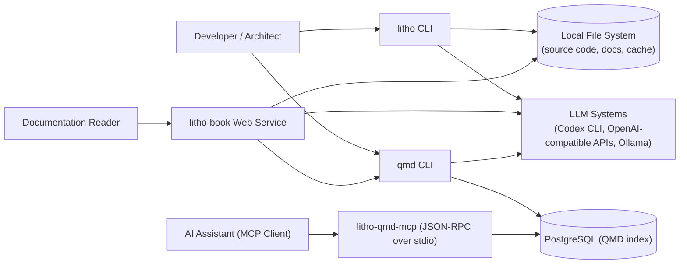
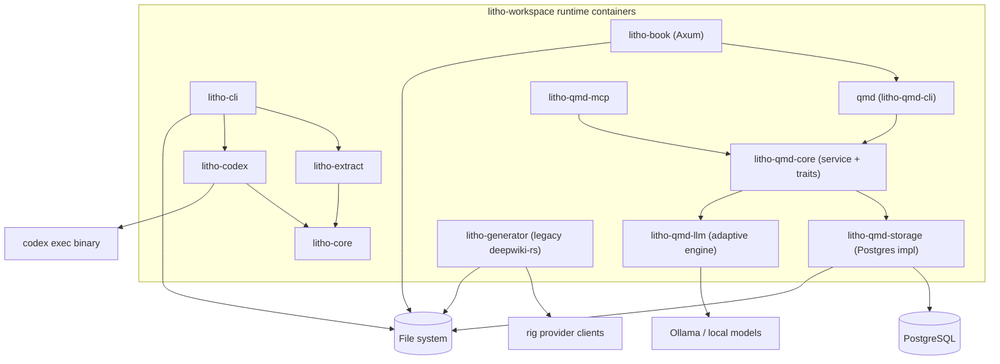
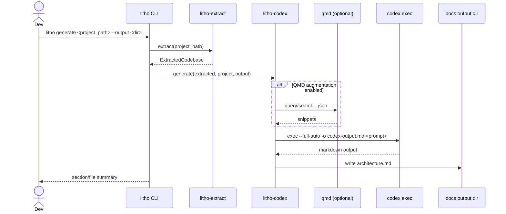
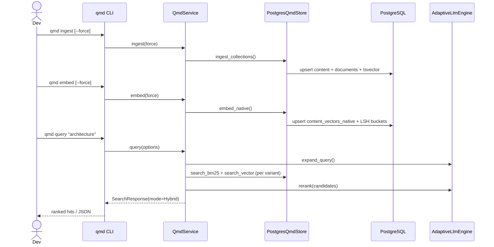
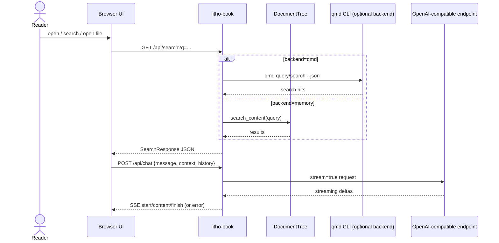
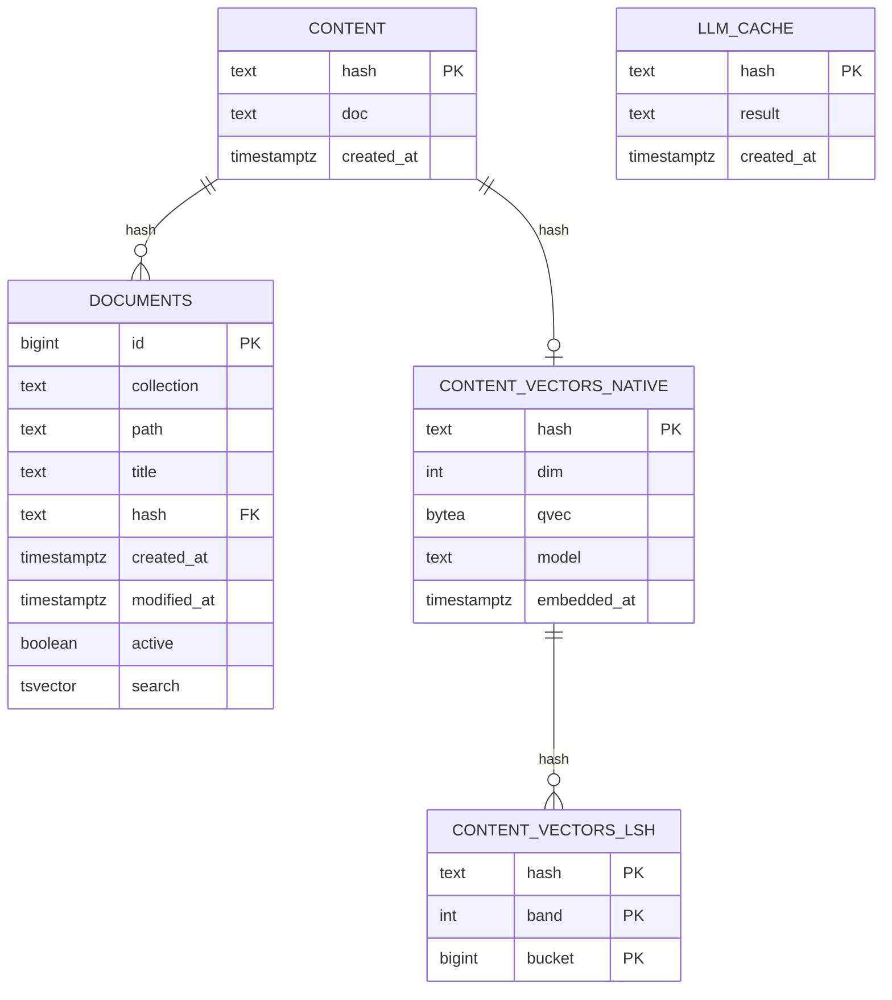

## Overview
`litho-workspace` is a Rust-first documentation intelligence platform with three primary outcomes:

- Extract structural facts from source code (`litho-extract` + `litho-core`).
- Generate C4-style architecture docs using LLMs (`litho-cli` + `litho-codex`, plus legacy `litho-generator`).
- Serve and query documentation (`litho-book`, `litho-qmd-*` search stack, MCP server).

Primary stakeholders:

- Developer/architect running CLI generation and search.
- Documentation consumers using the web reader.
- AI assistants/tools using MCP over stdio.
- Platform/operator configuring LLM providers, Postgres, and local model/runtime dependencies.

Key evidence:
- [workspace manifest](C:/codedev/litho-workspace/Cargo.toml)
- [litho CLI](C:/codedev/litho-workspace/crates/litho-cli/src/main.rs)
- [litho-book server](C:/codedev/litho-workspace/crates/litho-book/src/server.rs)
- [qmd CLI](C:/codedev/litho-workspace/crates/litho-qmd-cli/src/main.rs)
- [qmd MCP server](C:/codedev/litho-workspace/crates/litho-qmd-mcp/src/main.rs)

## Architecture
Container/component view (C2/C3):

- `litho-cli` orchestrates extraction and generation commands.
- `litho-extract` discovers files, classifies files, parses AST with Tree-sitter extractors, computes complexity, builds dependency graph.
- `litho-codex` builds structured prompts and invokes `codex exec`; optional retrieval augmentation via `qmd`.
- `litho-book` is an Axum web app: markdown tree/index/search + SSE chat proxy to OpenAI-compatible API.
- `litho-qmd-core` defines domain contracts (`QmdStore`, `QmdLlmEngine`) and `QmdService`.
- `litho-qmd-storage` implements `QmdStore` on PostgreSQL with BM25-like FTS, native quantized vector search, ingestion, embedding, cleanup.
- `litho-qmd-llm` implements `QmdLlmEngine` (Noop + adaptive Ollama expansion/rerank).
- `litho-qmd-cli` and `litho-qmd-mcp` are interface adapters over `QmdService`.
- `litho-generator` is a legacy parallel pipeline (preprocess → research agents → compose → outlet).

Key architectural patterns/decisions:

- Ports-and-adapters in QMD: `QmdService` depends on traits, not concrete infrastructure.
- Content-addressed persistence: `documents` reference `content` by BLAKE3 hash to dedupe content.
- Hybrid retrieval pipeline: BM25-style lexical + native vector + LLM rerank in `query`.
- Graceful degradation:
  - `litho-book` falls back from QMD search to in-memory search on command failure.
  - `litho-codex` works without QMD unless augmentation env flags are enabled.
- Strong local-first defaults:
  - no hardcoded external base URL defaults in core config,
  - explicit env/config for LLM and DB integration.
- Multi-stage memory-bus orchestration (legacy generator): preprocessing artifacts and research outputs are passed through scoped in-memory state.

Key evidence:
- [extract pipeline](C:/codedev/litho-workspace/crates/litho-extract/src/lib.rs)
- [codex prompt/build + qmd augmentation](C:/codedev/litho-workspace/crates/litho-codex/src/prompts.rs)
- [qmd service contracts](C:/codedev/litho-workspace/crates/litho-qmd-core/src/traits.rs)
- [qmd service orchestration](C:/codedev/litho-workspace/crates/litho-qmd-core/src/service.rs)
- [legacy workflow orchestrator](C:/codedev/litho-workspace/crates/litho-generator/src/generator/workflow.rs)

## Workflows
### 1) Extract + Generate (Codex path)

### 2) QMD ingest + embed + query

### 3) Web read/search/chat (`litho-book`)

Key evidence:
- [litho-cli generate flow](C:/codedev/litho-workspace/crates/litho-cli/src/main.rs)
- [codex exec adapter](C:/codedev/litho-workspace/crates/litho-codex/src/exec.rs)
- [qmd CLI handlers](C:/codedev/litho-workspace/crates/litho-qmd-cli/src/main.rs)
- [qmd storage ingest/embed/search](C:/codedev/litho-workspace/crates/litho-qmd-storage/src/lib.rs)
- [litho-book handlers + SSE](C:/codedev/litho-workspace/crates/litho-book/src/server.rs)

## Boundaries
External interface contracts:

- CLI boundary:
  - `litho extract <path> [--format json|summary] [--config <path>]`
  - `litho generate <path> [--provider codex] [--output <dir>] [--model <id>]`
  - `qmd {search|vsearch|query|get|multi_get|ls|status|ingest|embed|pull|update|cleanup|collection|context}`
  - `litho-qmd-mcp` stdio JSON-RPC server (`initialize`, `tools/list`, `tools/call`, `resources/list`, `resources/read`, `prompts/*`, lifecycle methods)

- HTTP boundary (`litho-book`):
  - `GET /api/file?file=<relative.md>` → `{content, html, path, size?, modified?}`
  - `GET /api/tree` → serialized markdown file tree
  - `GET /api/search?q=<text>` → `{results[], total, query}`
  - `GET /api/stats` → `{total_files, total_dirs, total_size, formatted_size}`
  - `POST /api/chat` (JSON) → SSE stream events (`start`, `content`, `finish`, `error`)
  - `GET /health` → status/version/timestamp

- MCP tool boundary (`litho-qmd-mcp` tools):
  - `search`, `vsearch`, `query` (query + limit/minScore/collection)
  - `get`, `multi_get`
  - `status`, `ingest`, `embed`
  - Tool responses return `content` summary + `structuredContent` payloads.

- Integration boundaries:
  - External command invocation: `codex`, `qmd`, `ollama`.
  - External APIs: OpenAI-compatible chat endpoint in `litho-book`; multiple LLM providers in legacy generator via `rig`.
  - Config surfaces: `qmd.config.json`, `.env`/env-vars, `litho.toml`.

Boundary/contract characteristics:

- QMD and MCP are unauthenticated by default (trust boundary is local environment/process).
- `litho-book` uses permissive CORS and no built-in auth; chat auth is outbound bearer to configured LLM endpoint.
- Path traversal hardening exists for markdown file reads in `DocumentTree` (canonical-path check).

Key evidence:
- [book routes/contracts](C:/codedev/litho-workspace/crates/litho-book/src/server.rs)
- [book filesystem guard](C:/codedev/litho-workspace/crates/litho-book/src/filesystem.rs)
- [MCP method/tool contracts](C:/codedev/litho-workspace/crates/litho-qmd-mcp/src/main.rs)
- [qmd CLI contracts](C:/codedev/litho-workspace/crates/litho-qmd-cli/src/main.rs)
- [runtime config](C:/codedev/litho-workspace/qmd.config.json)

## Database
Primary database applies to the QMD subsystem (`litho-qmd-storage`): PostgreSQL.

`litho-cli`/`litho-extract`/`litho-codex` do not require a relational DB; they use file-system outputs and optional retrieval calls.

### Logical ER model

### Storage patterns
- Content dedupe: raw doc body is stored once in `content` keyed by BLAKE3 hash.
- Document identity: `documents` keeps collection/path metadata and active flag (`UNIQUE(collection,path)`).
- Search indexing:
  - lexical index in `documents.search` (`to_tsvector('simple', ...)` with GIN index),
  - semantic index in `content_vectors_native` (`qvec` quantized embedding),
  - LSH prefilter index in `content_vectors_lsh` (`band,bucket`).
- Soft deletion lifecycle:
  - ingestion marks missing files `active=FALSE`,
  - cleanup removes inactive/orphaned rows and vacuums.
- Retrieval addressing:
  - supports `#docid`,
  - `collection/path`,
  - suffix lookup fallback,
  - `path:line` parsing for slicing.
- Config persistence:
  - collection/context configuration is YAML config file (not DB table),
  - DB connection/runtime behavior is driven by `qmd.config.json` + env.

Key evidence:
- [schema + indexes](C:/codedev/litho-workspace/crates/litho-qmd-storage/src/lib.rs)
- [qmd core models](C:/codedev/litho-workspace/crates/litho-qmd-core/src/model.rs)
- [ingest/embed/cleanup implementation](C:/codedev/litho-workspace/crates/litho-qmd-storage/src/lib.rs)
- [runtime DB config](C:/codedev/litho-workspace/qmd.config.json)